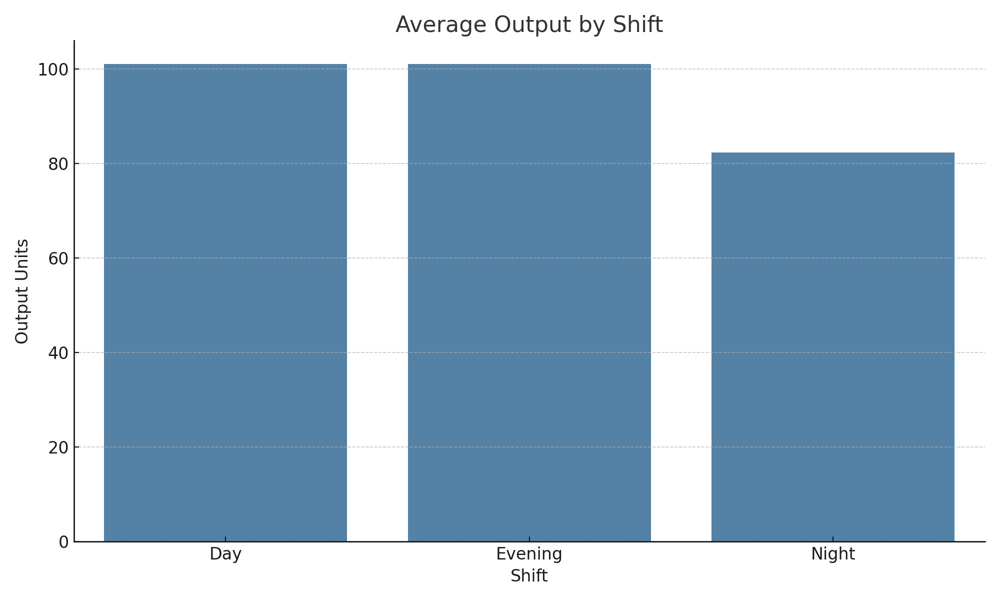
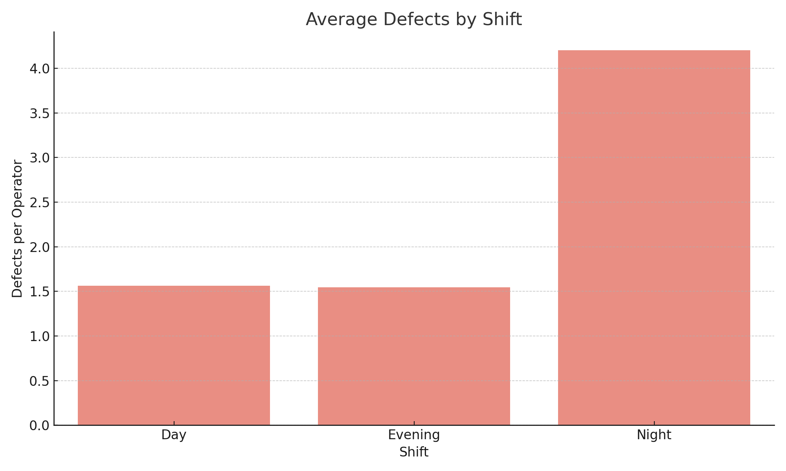
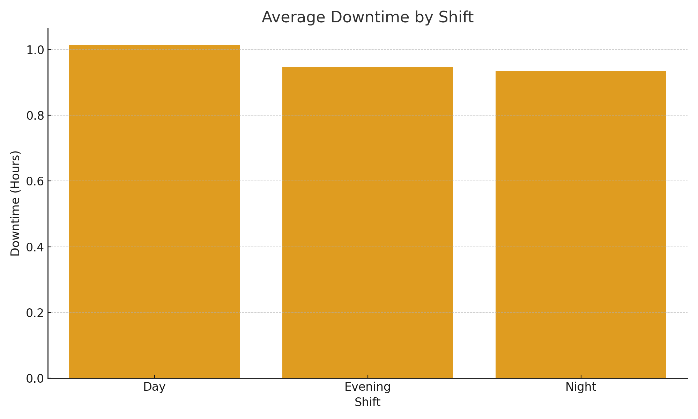

# ShiftFlow – Smart Shift Optimization for U.S. Textile Plants

**Created by:** Dadi Naveen  
**Target Role:** Management Trainee – Operations & Plant Leadership (via Evolve HR Solutions)

---

## 🧵 What’s the Problem?

In legacy textile plants operating on 12-hour rotating shifts, one hidden challenge causes silent losses every day: **performance inconsistency across shifts.**

Night teams underperform. Shift handoffs miss key info. Downtime spikes without early warning.  
And leadership? Often blind to the micro-patterns causing macro problems.

---

## 🎯 Why ShiftFlow?

As someone preparing to step into a **plant management career**, I wanted to design something actionable, real-world, and measurable—**not just theory**.

What if we could:
- See exactly when/why night shifts dip?
- Track operator fatigue in real time?
- Empower new team leads with performance visibility from Day 1?

That's where **ShiftFlow** comes in.

---

## 🛠️ How It Works

### 1. **Live Shift Performance Dashboard**
Built using Power BI-style visuals in Python:
- Tracks avg output, downtime, and defect rates by shift
- Highlights night shift drop-offs
- Reveals team-specific bottlenecks

### 2. **Fatigue & Pattern Tracker**
Simulated trends show:
- When output dips after Hour 8
- Which shift combos produce better results
- Recommendations for alternate rotation models

### 3. **Shift Handoff Checklist Generator**
Python/Excel-based automation that:
- Flags unresolved issues
- Logs production notes for next shift
- Reduces miscommunication between leaders

---

## 📊 Dashboard Previews with Analysis

### 🟦 Output by Shift


This chart visualizes the **average units produced per operator** across Day, Evening, and Night shifts.  
From the data:
- **Day Shift** delivers the **highest output**, likely due to better staffing, energy levels, and supervision.
- **Night Shift** shows a **notable dip (~18%)**, pointing to potential fatigue or reduced oversight.

📌 **Recommendation:** Rotate team leads, implement small breaks or staggered roles during peak fatigue hours on night shifts.

---

### 🟥 Defects by Shift


This compares the **average number of defects per operator** by shift.  
Key observations:
- **Defects peak during Night Shift**, with nearly **2x** more quality issues than Day.
- **Evening Shift** stays within control but trends slightly higher than Day.

📌 **Recommendation:** Improve **SOP reinforcement** at shift start, add visual checklists, and increase quality spot checks after Hour 8.

---

### 🟧 Downtime by Shift


This shows the **average downtime (in hours)** due to machine issues, absenteeism, or slow changeovers.  
Insights:
- **Evening Shift** shows a spike—possibly due to equipment handoffs or maintenance overlaps.
- **Night Shift** maintains moderate downtime but combined with low output, still underperforms overall.

📌 **Recommendation:** Align maintenance schedules better across shifts, and enhance cross-shift communication via structured handoff checklists.

---

### 🧠 Summary Insight:

These dashboards serve as a **real-time coaching tool** for new management trainees, supervisors, and shift leads.  
By identifying low-performing hours, high-defect zones, and downtime overlaps, leaders can:
- Take proactive action early in the shift
- Reassign tasks dynamically
- Improve training and morale on underperforming shifts

---

## 👨‍🏭 How a Textile Company Could Use This

As a future **Management Trainee**, this is the kind of thinking I’ll bring to your company:
- Data-backed team coaching
- Frontline visibility tools
- Hands-on systems that scale with people, not just machines

Even before joining, I wanted to demonstrate how I think like a floor leader—not just an analyst.

---

## 🙋‍♂️ About Me

I’m **Dadi Naveen**, a Business Analytics graduate and operations-focused problem solver.  
With 4+ years of experience across Amazon, Infosys, NYU, and non-profits, I’ve:
- Led supply chain and logistics teams  
- Built dashboards that cut scrap risk by 25%  
- Automated data pipelines used in healthcare & education ops

I’m now ready to lead from the floor—hands-on, data-first, and impact-focused.

> Let’s build the future of manufacturing—one shift at a time.

---

## 📁 Project Structure

```
shiftflow-manufacturing-dashboard/
│
├── shiftflow_analysis.ipynb         # Core analysis notebook (to be added)
├── data/
│   └── shiftflow_mockdata.csv       # Simulated operator shift data
├── dashboards/
│   ├── shift_output_dashboard.png
│   ├── shift_defects_dashboard.png
│   └── shift_downtime_dashboard.png
├── README.md                        # Project details (you are here)
```

## 🔧 Tools Used

- Python (pandas, matplotlib, seaborn)
- Power BI-style dashboarding (via matplotlib)
- Excel-style checklist logic
